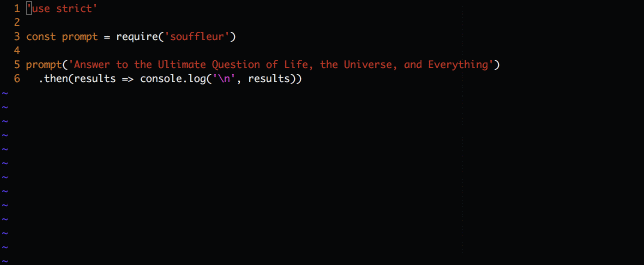

# Souffleur
Simple promise-based command line prompt with retry for empty answers and without external dependencies.

<h1 align="center">
  
  <br>
</h1>

## Installation

```bash
npm install souffleur
```

## Usage

Souffleur is simple promise based prompt.

If you have just one question pass the question as a string to `souffleur` or if you have more questions pass an array.

It'll return an object with each question as a key and each answer as a value.

```
const prompt = require('souffleur')

// For single question
prompt('Any question')
  .then(results => console.log(results)) // Returns {"Any question": "some answer"}
  
// For multiple questions
prompt(['Question1', 'Question 2'])
  .then(results => console.log(results)) // Returns {"Question1": "Answer1", "Question 1": "Answer 2"}
```
If you pass an empty answer it'll prompt again with the same question.

Simple demo:



## Running tests

Run all the tests:

```bash
npm run test
```

Run only some tests:

```bash
npm run test -- filter=prefix
```

Get detailed hierarchical test name reporting:

```bash
npm run test -- full
```

## Other

Feather icon by [Mister Pixel from the Noun Project](https://thenounproject.com/MisterPixel/).

## Licence

MIT - see [LICENSE](LICENSE)
